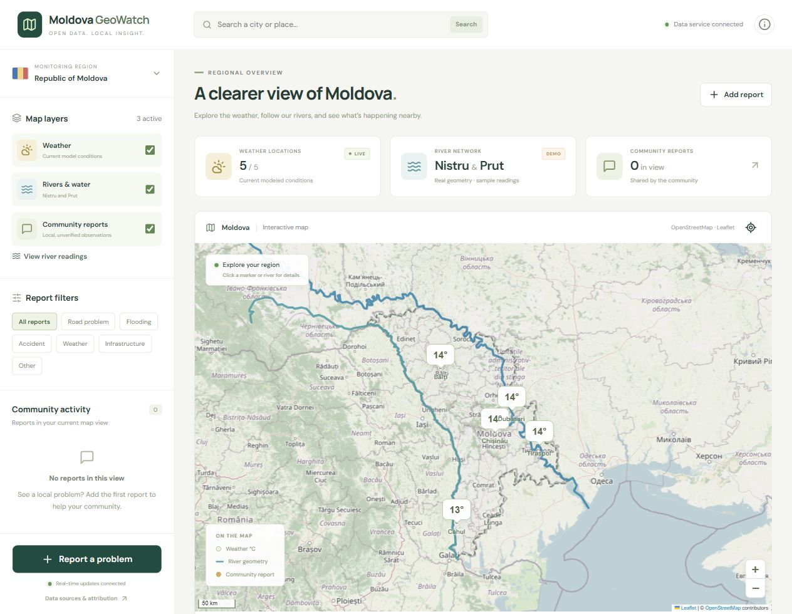

# Moldova GeoWatch

An open-data geospatial dashboard for Moldova: current weather models, real river geometry and anonymous community reports. Designed for local, zero-subscription-cost development and extensible country coverage.



## Live Demo

Public deployment is pending Render account authorization. No public application URL has been verified yet. The source is available at [Scofari/moldova-geowatch](https://github.com/Scofari/moldova-geowatch).

## What it does

Explore a real interactive map, inspect weather conditions, read clearly marked sample river levels, and report a local problem. Another connected browser receives new reports and confirmations immediately.

This is an informational MVP. Community statements are unverified; synthetic river levels are never official warnings.

## Features

- Leaflet/OpenStreetMap map with a real country boundary, five Natural Earth populated places, Nistru/Dniester and Prut centerlines.
- Independently toggled weather, rivers and community layers. Map state survives layer changes.
- Normalized Open-Meteo modeled weather: Celsius, km/h, mm, model timestamp and retrieval timestamp.
- Real river geometry alongside explicitly **DEMO** synthetic water levels and fixed fixture timestamps.
- Anonymous report selection on the map or keyboard coordinate entry; six categories, plain-text validation and public provenance.
- PostgreSQL/PostGIS persistence, indexed bbox queries and category/country filters.
- Transactional confirmations, one per hashed network address per report.
- Socket.IO broadcasts, reconnect reconciliation and a one-minute polling fallback.
- Explicit location searches through Open-Meteo/GeoNames, with a 24-hour server cache.
- Mobile map workspace, layers/filter drawer, keyboard focus scopes, loading/error/empty states.

## Architecture

```text
Open Data / Weather / River Sources
                |
                v
          NestJS API
                |
        ----------------
        |              |
        v              v
 PostgreSQL/PostGIS  WebSocket
        |              |
        -------+--------
               |
               v
       React + TypeScript
               |
               v
          Map Adapter
          /         \
   LuciadRIA      OSS fallback
 (private SDK)      (Leaflet)
               |
               v
       Interactive Map
```

Shared Zod contracts validate report/query DTOs at the API boundary. Domain models use ISO country codes and WGS84 positions; map SDK imports exist only inside the map module. SQL uses parameters. Geometry and water observations have independent providers/provenance.

Reports use `geography(Point,4326)`; a GiST expression index over `location::geometry` serves rectangular bbox intersection without duplicating coordinate columns. Confirmation insertion and count increments share a row-locked transaction. Migrations use an advisory lock and a version table.

**Tradeoffs:** direct pg queries make spatial operations clear with fewer dependencies than an ORM. Single-process caches/throttles keep the MVP inexpensive. Leaflet supports this 2D monitoring scope without the complexity of a vector-style pipeline. Neither distributed operation nor licensed LuciadRIA is claimed as verified.

## Tech Stack

Node.js >=22, npm workspaces, React 19, TypeScript, Vite 7, TanStack Query, Leaflet, NestJS 11, Socket.IO, PostgreSQL 17/PostGIS 3.5, Zod, Vitest, ESLint and Prettier. Docker Desktop/Engine is needed only for the local database. No mandatory cloud or paid API.

## Local Development

Start Docker first. From the repository root:

```sh
docker compose up -d --wait
npm install
cp .env.example .env
npm run dev
```

On PowerShell, use `Copy-Item .env.example .env` instead of `cp`.

Open [the dashboard](http://127.0.0.1:5173). API: [health](http://127.0.0.1:3001/api/health). Use **127.0.0.1**, consistently with the configured origin, rather than changing between localhost and 127.0.0.1. Default ports must be available.

Shared contracts build automatically before dev/tests/typechecking. The API applies migrations at startup and fails explicitly if PostGIS cannot connect. Geography is already included; no geography download is needed to start. Weather, tiles and search require internet access.

Stop the app with Ctrl+C. Stop the DB with `docker compose stop`. Its named volume preserves reports. Never remove a database volume unless you intend to erase its contents.

### Production build locally

```sh
npm run build
npm run start -w @geowatch/api
npm run preview -w @geowatch/web
```

Before production-mode API startup, explicitly set `DATABASE_URL`, `NODE_ENV=production`, a private random `IP_HASH_SALT`, and the actual `WEB_ORIGIN` (preview defaults to http://127.0.0.1:4173). Set `DATABASE_SSL=false` only for the local database. Restart after environment changes. The preview proxies API/WebSocket requests locally.

## Production Deployment

The selected €0 architecture uses one Render Free Node service for the frontend, NestJS API and Socket.IO, plus Supabase Free PostgreSQL/PostGIS. The backend serves the compiled Vite frontend on the same HTTPS origin, so relative API/WebSocket URLs work without exposing backend secrets to the browser. Render handles HTTPS; the database connection verifies TLS certificates.

The cloud database is provisioned and its migrations/indexes verified; application deployment awaits Render sign-in and private database connection configuration. See [deployment instructions, costs, limitations and pending public checks](docs/DEPLOYMENT.md). The committed [Render Blueprint](render.yaml) explicitly selects Free compute. No public deployment success is claimed.

## Environment Variables

Copy the root [.env.example](.env.example); it contains commented placeholders, so localhost defaults work until you uncomment and configure an override. The resulting `.env` is ignored by Git. Vite reads root environment files and exposes only variables prefixed `VITE_`.

| Variable           | Default / purpose                                                                      |
| ------------------ | -------------------------------------------------------------------------------------- |
| DATABASE_URL       | Local PostGIS connection, backend only                                                 |
| PORT               | API port 3001; Vite local proxy follows it                                             |
| HOST               | Local bind 127.0.0.1; Render uses 0.0.0.0                                              |
| SERVE_WEB          | false locally; true serves the compiled frontend through NestJS                        |
| DATABASE_SSL       | false in development; verified TLS defaults to true in production                      |
| DATABASE_CA_CERT   | Optional provider CA certificate for backend TLS verification                          |
| WEB_ORIGIN         | Allowed HTTP/WebSocket origin, default http://127.0.0.1:5173                           |
| IP_HASH_SALT       | Minimum 32 characters; private production salt required                                |
| NODE_ENV           | development, test or production                                                        |
| TRUST_PROXY        | false; set true only behind exactly one trusted proxy                                  |
| WEATHER_BASE_URL   | Open-Meteo forecast endpoint; operator-controlled                                      |
| GEOCODING_BASE_URL | Open-Meteo place search endpoint; operator-controlled                                  |
| POSTGRES_PASSWORD  | Optional Compose DB password; update DATABASE_URL to match                             |
| VITE_MAP_PROVIDER  | oss by default; luciad requires a private licensed integration                         |
| VITE_TILE_URL      | Standard OSM raster tiles; use another policy-compatible tile service if scale changes |

Defaults are local development credentials, not production secrets. Changing POSTGRES_PASSWORD after volume creation does not change the existing PostgreSQL role password automatically.

## LuciadRIA setup

No LuciadRIA SDK, credentials or license existed in this workspace. **The verified map renderer is Leaflet.** LuciadMapAdapter is a typed integration boundary, not an implemented or tested LuciadRIA renderer.

An authorized SDK and valid development/deployment licenses must be obtained from Hexagon. The SDK is customer-distributed through its npm packages; runtime license initialization is required. Keep the SDK/private integration and license outside the open-source source tree, and use the vendor-approved distribution procedure. License text delivered to a browser is not a backend secret; its permitted distribution still depends on the customer agreement.

See [licensed integration instructions](docs/LUCIADRIA.md). Selecting luciad without the integration shows an explicit error; it does not silently substitute an emulated SDK.

## Data Sources

See [complete provenance and terms](docs/DATA_SOURCES.md).

| Data                 | Provider                   | State                                                  |
| -------------------- | -------------------------- | ------------------------------------------------------ |
| Base tiles           | OpenStreetMap contributors | Interactive third-party tiles                          |
| Border/cities/rivers | Natural Earth v5.1.2       | STATIC real geometry                                   |
| Weather              | Open-Meteo                 | LIVE provider **model output**, not gauge measurements |
| River water levels   | Synthetic local fixtures   | DEMO, fixed January 1, 2026 timestamps                 |
| Search               | Open-Meteo / GeoNames      | Real provider place lookup                             |
| Community reports    | Actual local users         | Persisted, anonymous, unverified                       |

Open-Meteo's free service is **noncommercial only**. An advertising/subscription/commercial version cannot assume this free endpoint is permitted. The public OSM tile service has limited capacity and no SLA. The €0 goal applies to local, modest, noncommercial use; it is not a guarantee of free public infrastructure at scale.

Regenerate the geography deliberately with `npm run data:refresh` from the root. The script pins upstream v5.1.2, retains real geometry and writes a provenance manifest. Do not run it on every page load.

## API

See [contracts and examples](docs/API.md). JSON errors carry a human-readable message; validation errors include field issues.

| Method | Route                                                      | Purpose                                         |
| ------ | ---------------------------------------------------------- | ----------------------------------------------- |
| GET    | /api/health                                                | Database/PostGIS readiness                      |
| GET    | /api/weather?lat=47.01&lon=28.86                           | Normalized weather                              |
| GET    | /api/rivers?countryCode=MD                                 | Geometry and independently sourced observations |
| GET    | /api/search?q=Orhei&countryCode=MD                         | Submitted place lookup                          |
| GET    | /api/reports?bbox=26,45,30,49&category=road&countryCode=MD | Up to 500 reports + truncated flag              |
| GET    | /api/reports/:id                                           | Report detail                                   |
| POST   | /api/reports                                               | Create a report                                 |
| POST   | /api/reports/:id/confirm                                   | Atomic deduplicated confirmation                |

Socket.IO events: `report.created`, `report.confirmed`. Each sends a shared CommunityReport. Clients can only subscribe; report writes go through guarded HTTP routes.

## Testing

```sh
npm run lint
npm run typecheck
npm run test
npm run build
npm run format:check
```

With the database and API running in a **local development** environment:

```sh
npm run test:integration
```

The integration runner creates temporary test reports, checks PostGIS filters, two WebSocket clients, confirmations, throttling, origin rejection and **real** weather/search requests. It removes only IDs it created. It consumes the five-request submission quota: wait one minute or restart the local API before immediately repeating it. Do not point it at a production database. Unit tests mock provider failures; they do not claim real-provider availability.

See [verification evidence](docs/VERIFICATION.md) for the checks performed on this machine.

## Project Structure

```text
apps/
  api/
    data/                 # extracted river geometry + provenance
    migrations/           # versioned PostGIS SQL
    src/
      common/             # validation, provider cache and quotas
      db/                 # pool and migration runner
      weather/            # provider, service, controller, module
      rivers/             # separate geometry/observation concerns
      reports/            # repository/service, controller, gateway
      geocoding/
      health/
  web/
    public/data/          # country geometry and place extract
    src/
      app/                # dashboard orchestration
      components/         # header, sidebar, source dialog, cards
      features/           # map, weather presentation, reports, search
      map/                # SDK-isolated MapAdapter implementations
      api/
      hooks/
packages/shared/src/      # domain types, validation and utilities
scripts/                  # reproducible data import + integration checks
docs/                     # provenance, API, LuciadRIA, verification
```

## Limitations

- No verified public machine-readable Moldova water-level feed with clear reuse terms was found. DEMO levels do not track real rivers.
- LuciadRIA rendering cannot be implemented/verified against an absent proprietary SDK/license; the customer integration remains external.
- Only MD geography/configuration ships. Adding a country requires country metadata and a reviewed geography import; core report/weather/search types are country-neutral.
- Anonymous confirmations are limited by network address. Shared NAT/VPN users can collide; determined users can change IPs. There is no moderation, ownership, edit/delete workflow, emergency verification or authentication.
- The API caps viewport results at 500 and reports truncation. No clustering, pagination or offline map is included.
- Provider caches, rolling request budgets, submission limits and Socket.IO fanout belong to one process. Restarting resets local quota accounting. Multiple instances require shared state.
- External providers may fail. Failed requests show errors and retry controls rather than synthetic weather/reports.
- Country and river geometry is generalized 1:10m context. Boundaries are cartographic data, not political adjudication or survey-grade positions.
- IP confirmation hashes persist with reports; retention and privacy policy need an explicit decision before public deployment. There is no analytics.
- Code is MIT; external datasets and services have their own terms. Provider integrations are designed for a noncommercial educational MVP.

## Roadmap

1. Add moderation, report lifecycle/expiry and privacy retention before broad public access.
2. Secure a documented, permitted hydrology feed through an authority/open-data partnership.
3. Add marker clustering and cursor pagination for busy viewports.
4. Ship a second country import (Romania) to demonstrate the country-neutral architecture.
5. Add repeatable browser regression CI and an optional customer-licensed LuciadRIA integration test.

For hiring, the strongest evidence is the reproducible spatial/API tests and honest data provenance. For income, a generic consumer map has weak differentiation; pilot a focused municipal maintenance or infrastructure workflow only after moderation, a customer need and permitted commercial data access are established.
